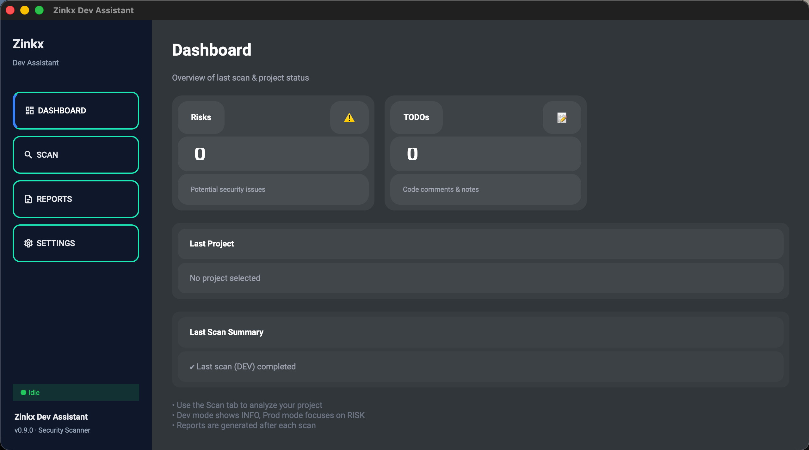
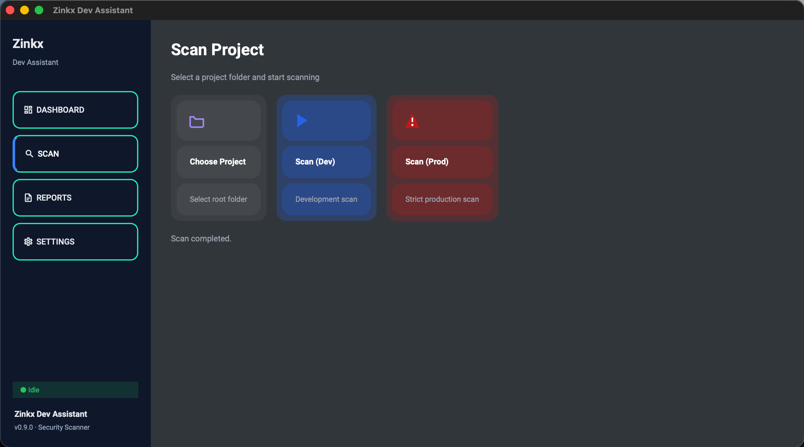
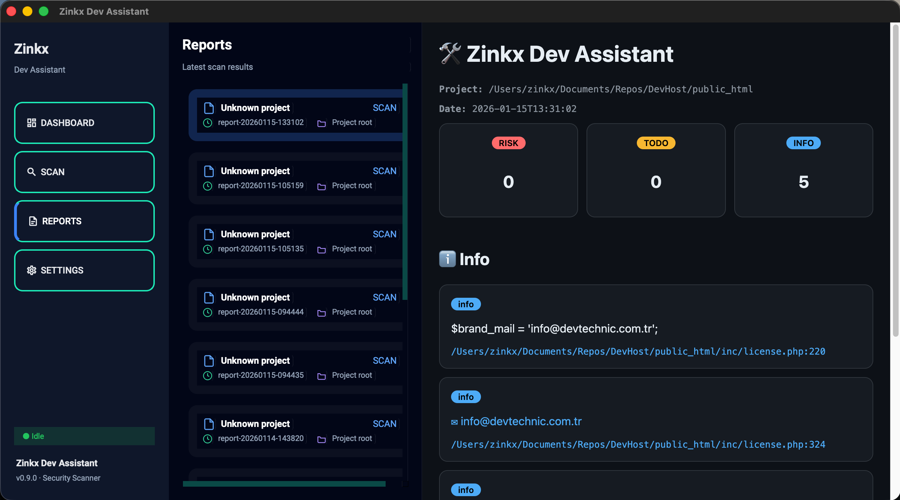
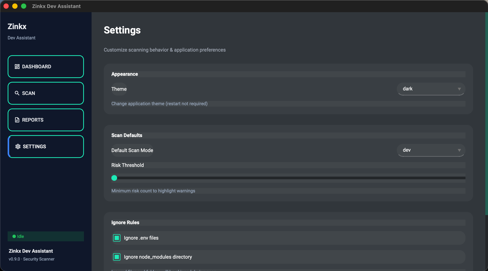

# Zinkx Dev Assistant 🛠️

**Zinkx Dev Assistant**, yazılım projelerini geliştirme sürecinde analiz eden, raporlayan ve geliştiriciye rehberlik eden **Python tabanlı bir masaüstü yardımcı uygulamadır**.

Kod kalitesi, proje sağlığı, riskli noktalar ve yapılması gerekenler konusunda geliştiriciye hızlı ve anlaşılır geri bildirim sunmayı amaçlar.

---

## 🚀 Özellikler

- 🔍 **Proje Tarama (Scanner)**

  - Dosya yapısı analizi
  - Riskli dosya ve pattern tespiti
  - Git değişiklikleri analizi

- 📊 **Raporlama Sistemi**

  - HTML rapor üretimi
  - Detaylı modül bazlı çıktılar
  - Okunabilir ve görsel odaklı raporlar

- 🧩 **Pre-commit Entegrasyonu**

  - Commit öncesi otomatik kontrol
  - Riskli durumlarda uyarı
  - Geliştirici disiplinini artırır

- 🖥️ **Masaüstü Arayüz**

  - Modern Python GUI yapısı
  - macOS uyumlu dosya/dizin seçici
  - Ayarlar ve rapor ekranları

- ⚙️ **Esnek Konfigürasyon**

  - `config.py` üzerinden yönetim
  - IPC tabanlı modüler yapı

---

## 📁 Proje Yapısı

```
zinkx-dev-assistant/
│
├─ src/
│  ├─ app.py              # Uygulama giriş noktası
│  ├─ main_window.py      # Ana pencere (UI)
│  ├─ scanner.py          # Proje tarama motoru
│  ├─ report.py           # Rapor veri modeli
│  ├─ report_html.py      # HTML rapor üretimi
│  ├─ precommit_runner.py # Pre-commit kontrol sistemi
│  ├─ git_changed.py      # Git değişiklik analizleri
│  ├─ settings_ui.py      # Ayarlar arayüzü
│  ├─ config.py           # Uygulama ayarları
│  ├─ ipc.py              # Process / IPC iletişimi
│  └─ macos_picker.py     # macOS dosya seçici
│
├─ assets/
│  ├─ icon.png
│  └─ icons/
│
├─ reports/               # Üretilen raporlar
│
└─ README.md
```

---

## 🧪 Gereksinimler

- Python **3.10+**
- macOS / Linux / Windows
- Gerekli paketler:

  ```bash
  pip install -r requirements.txt
  ```

> (requirements.txt yoksa, proje büyüdükçe eklenmesi önerilir)

---

## ▶️ Çalıştırma

```bash
python src/app.py
```

veya

```bash
python src/launcher.py
```

---

## 🧠 Amaç

Bu proje;

- Geliştiricinin **kod kalitesini yükseltmesini**
- Proje içinde **riskli alanları erkenden fark etmesini**
- Daha **disiplinli commit alışkanlıkları** kazanmasını

hedefler.

---

## 🧑‍💻 Geliştirici

**Zinkx**
GitHub: [https://github.com/zinkxx](https://github.com/zinkxx)

---

## 📜 Lisans

Bu proje **MIT Lisansı** ile lisanslanmıştır.
Detaylar için `LICENSE` dosyasına bakınız.

---

## ⭐ Support the Project

If you find **Zinkx Dev Assistant** useful:

- ⭐ Star the repository
- 🍴 Fork it and improve
- 🐞 Open issues for bugs or ideas
- 💬 Share feedback and suggestions

Your support helps the project grow 🚀

## 🖼️ Screenshots





